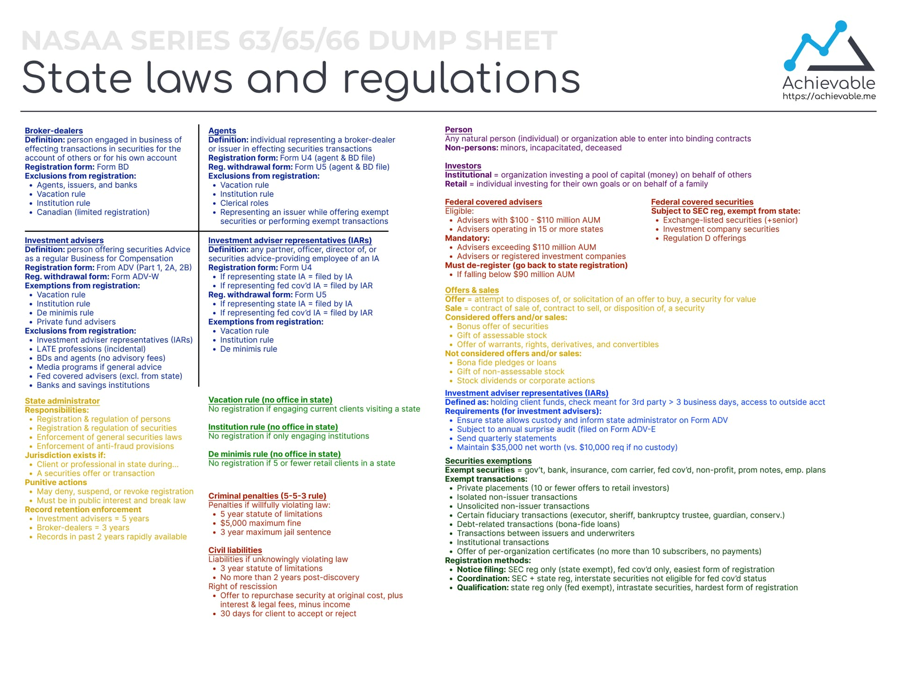

- **A-B-C Test** for Investment Advisors:

  - **A**dvice (securities-related)
  - **B**usiness (ordinary course of)
  - **C**ompensation (received for advice)

- **LATE Professionals**: Lawyers, Accountants, Teachers, Engineers
  The professional do not have to regsiter if they give non-indecdntal advice
  qualified clien
  An IA can charge a percentage of total assets under management for qualified clients who have at least $1.1 million invested with the IA or who have a net worth of $2.2 million.

Form ADV

What is a state admin and what do they do

### Differences Between State Registered vs. Federally Covered Investment Advisors

#### Key Points:

- **Both State Registered and Federally Covered Investment Advisors:**

  - Must register in the state where they have a **physical office**.

- **State Registered Advisors:**
  - Must register in any state where they have **solicited over 5 retail (non-institutional) clients** within a 12-month period.
  - Client solicitation threshold (over 5 retail clients) determines the need for state registration.
- **Federally Covered Advisors:**
  - Do **not** need to register based on the number of clients in a state.
  - Only required to register in a state if they maintain a **physical office** there.
  - **Office location**, not the number of clients, is the key determinant for registration.

#### Summary:

- The main factor for state registration:

  - For **state registered advisors**: the number of retail clients.
  - For **federally covered advisors**: the presence of a physical office.

  ### Differences Between State Registered vs. Federally Covered Investment Advisors

#### Key Points:

- **Both State Registered and Federally Covered Investment Advisors:**

  - Must register in the state where they have a **physical office**.

- **State Registered Advisors:**
  - Must register in any state where they have **solicited over 5 retail (non-institutional) clients** within a 12-month period.
  - Client solicitation threshold (over 5 retail clients) determines the need for state registration.
- **Federally Covered Advisors:**
  - Do **not** need to register based on the number of clients in a state.
  - Only required to register in a state if they maintain a **physical office** there.
  - **Office location**, not the number of clients, is the key determinant for registration.

#### Summary:

- The main factor for state registration:
  - For **state registered advisors**: the number of retail clients.
  - For **federally covered advisors**: the presence of a physical office.

https://www.professionalexamtutoring.com/series-63-pass-rate/

### **Regulation Best Interest (Reg BI)** – **Broker-Dealers**

- **Definition**: Reg BI requires broker-dealers (BDs) to act in the **best interest** of retail clients at the time of a recommendation, without prioritizing their own interests.

- **Key Obligations**:

  1. **Disclosure**: Must disclose material facts about the recommendation and conflicts of interest.
  2. **Care**: Must exercise reasonable diligence, care, and skill to ensure the recommendation is in the client’s best interest.
  3. **Conflict of Interest**: Must identify, disclose, and mitigate conflicts.
  4. **Compliance**: Must have policies and procedures ensuring compliance with Reg BI.

- **Standard**: Applies only during specific recommendations (transactional).

---

### **Fiduciary Standard** – **Investment Advisers**

- **Definition**: Investment advisers (IAs) must act in the **best interest** of clients at all times, providing ongoing, comprehensive advice.

- **Key Obligations**:
  1. **Duty of Loyalty**: Must avoid or disclose conflicts and act with undivided loyalty.
  2. **Duty of Care**: Must ensure advice is suitable and provide ongoing monitoring.
  3. **Best Execution**: Must seek the best possible terms for client transactions.
- **Standard**: Ongoing fiduciary duty that applies throughout the client relationship.

---

### **Key Differences**:

- **Reg BI (BDs)**: Transactional, focused on best interest at the time of a recommendation.
- **Fiduciary Standard (IAs)**: Continuous, requiring IAs to put the client's interests first and provide ongoing advice.

### Exempt Transactions – Uniform Securities Act (USA)

| **Type of Exempt Transaction**               | **Description**                                                                       |
| -------------------------------------------- | ------------------------------------------------------------------------------------- |
| **Isolated Non-Issuer Transactions**         | Occasional sales that don’t involve the issuer, like private sales between investors. |
| **Unsolicited Brokerage Transactions**       | Transactions initiated by the client without broker solicitation.                     |
| **Transactions with Financial Institutions** | Transactions between issuers and banks, insurance companies, or pension funds.        |
| **Private Placements**                       | Sales to no more than 10 non-institutional investors within a 12-month period.        |
| **Fiduciary Transactions**                   | Transactions by executors, trustees, or guardians managing assets for someone else.   |

---

### Exempt Transactions – SEC (Federal Securities Law)

| **Type of Exempt Transaction**                  | **Description**                                                                                                                                                                                                       |
| ----------------------------------------------- | --------------------------------------------------------------------------------------------------------------------------------------------------------------------------------------------------------------------- |
| **Regulation D (Private Placements)**           | Exemptions for private offerings, including:   - **Rule 506(b)**: Unlimited accredited investors + 35 non-accredited investors   - **Rule 506(c)**: General solicitation but only accredited investors can buy. |
| **Regulation A**                                | Allows companies to raise up to $75 million without full SEC registration.                                                                                                                                            |
| **Intrastate Offerings (Rule 147 & 147A)**      | Offerings sold only to residents of a single state.                                                                                                                                                                   |
| **Regulation S**                                | Offers made outside the U.S. to foreign investors.                                                                                                                                                                    |
| **Rule 144 (Resales of Restricted Securities)** | Allows resales of restricted securities, subject to holding periods and volume limitations.                                                                                                                           |

An advertisement in a newspaper is only considered an offer in the state where the paper is published. However, if more than two-thirds of the paper’s circulation is outside the state of publication, the advertisement is not considered an offer in any state. Since the Hometown Gazette is a local paper, assume that its distribution is primarily in the state of publication.

Form ADV made simple
Form ADV is used by IA to register with the state.

Part 1 provides information about the firm such type of business (LLC, Sole proprietorship ect), location blah blah

Part 2 is THE brochure. It basically answers any question a client may have (fees, how it is calculated, discretionary authority, term of contract).

That's how I make sense of it.

Consent to service of process is a legal agreement in which an individual or entity agrees to accept legal papers in a jurisdiction where they may not physically reside or have a place of business.

